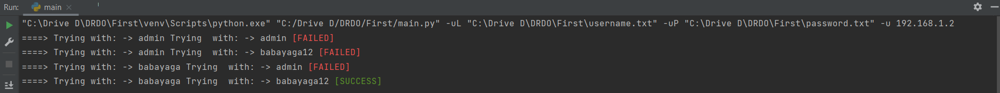

# SSH-BruteForce
It is a simple implementation of a SSH bruteforce tool.

# How to install required python modules?
```bash
pip3 install -r requirements.txt
```

# How to use it?
```bash
python3 main.py -h
```

# Results

